# Income Classification and Customer Segmentation Report

## 1. Project Overview

This project supports a retail business in improving targeted marketing through data-driven methods using U.S. Census Current Population Survey data. It addresses two complementary objectives: (1) predicting whether an individual falls into a higher or lower income category based on demographic and socioeconomic characteristics, and (2) identifying meaningful subgroups within the population.

The first objective focuses on income classification as a supervised learning task aimed at distinguishing individuals above and below a \$50,000 income threshold. It is designed to support targeted decision-making by producing a clear binary outcome that can be used for prioritization and eligibility filtering in marketing contexts. In addition to predictive performance, emphasis is placed on interpretability, with models selected to help clarify which demographic, employment, socioeconomic, and household factors are most strongly associated with income level.

The second objective focuses on customer segmentation as an unsupervised learning task aimed at discovering inherent structure within the population. Rather than predicting a predefined label, this approach identifies groups of individuals who share similar characteristics across demographic, employment, and socioeconomic dimensions. The resulting segments are data-driven and descriptive, providing a richer view of heterogeneity in the customer base and supporting the design of differentiated marketing strategies, customer profiles, and resource allocation approaches.

Together, these two components support marketing strategy by enabling both individual-level classification for prioritization and group-level segmentation for structural understanding, allowing decisions to be informed by both targeted prediction and broader population patterns.

## 2. Dataset Overview

The dataset used for this project was derived from the 1994 and 1995 Current Population Surveys conducted by the U.S. Census Bureau. It contains 199,523 observations and 40 features capturing demographic, employment, socioeconomic, and household characteristics of individuals. In addition, the dataset includes a target variable (`label`) and a sample weight variable (`weight`).

### 2.1. Target Variable

The `label` column defines the supervised learning target and represents a binary income category:

- A value of `- 50000.` indicates an income less than or equal to \$50,000.
- A value of `50000+.` indicates an income greater than \$50,000.

The labels are stored as strings, including the trailing period as part of the category encoding.

### 2.2. Sample Weights

The dataset includes a sample weight variable called `weight`, which reflects the survey design and is used to adjust for sampling bias in the census data. This weight is important for ensuring that model evaluation accurately represents the underlying population distribution rather than the raw sample distribution. While the sample weights were also used during model training, alternative weighting strategies were explored to address class imbalance; however, final evaluation metrics were consistently computed using the sample weights.

### 2.3. Feature Set

The dataset contains a mix of numerical and categorical features spanning several domains, such as demographics, employment, financial indicators, and household characteristics:

- **Demographics Attributes:** `age`, `race`, `sex`, `hispanic origin`, `citizenship`, `country of birth self`, `country of birth father`, `country of birth mother`

- **Education and Schooling:** `education`, `enroll in edu inst last wk`

- **Employment Type and Job Structure:** `class of worker`, `full or part time employment stat`, `member of a labor union`, `reason for unemployment`, `own business or self employed`, `num persons worked for employer`, `detailed occupation recode`, `major occupation code`, `detailed industry recode`, `major industry code`

- **Income and Financial Indicators:** `wage per hour`, `capital gains`, `capital losses`, `dividends from stocks`

- **Work History:** `weeks worked in year`

- **Veteran and Military Status:** `fill inc questionnaire for veteran's admin`, `veterans benefits`

- **Household and Family Structure:** `marital stat`, `detailed household and family stat`, `detailed household summary in household`, `family members under 18`, `tax filer stat`

- **Geography and Migration History:** `region of previous residence`, `state of previous residence`, `migration code-change in msa`, `migration code-change in reg`, `migration code-move within reg`, `lived in this house 1 year ago`, `migration previous residence in sunbelt`

- **Temporal Identifiers:** `year`

- **Additional Features:** `weight`, `label`

Some categorical features are encoded using integers to discrete categories, particularly within occupation and industry-related fields. As a result, the dataset requires careful preprocessing, including appropriate encoding strategies before model training.

### 2.4. Data Characteristics

The dataset presents several modeling challenges typical of large-scale survey-based tabular data. It contains a large number of observations with mixed data types, requiring heterogeneous preprocessing strategies across feature groups. The target variable exhibits a large class imbalance, which is present in both weighted and unweighted distributions. In addition, the dataset is survey-weighted, requiring appropriate handling of sample weights in both training and evaluation to ensure representativeness. Finally, the feature space is moderately high-dimensional, with potential redundancy and inter-feature correlation across demographic, occupational, and socioeconomic attributes.

## 3. Data Exploration and Preprocessing

Before model development, the dataset was explored to understand its structure, identify challenges, and define suitable preprocessing steps. Particular attention was paid to the survey-based nature of the data, including class imbalance, feature relationships, and survey-specific representations of missing or non-applicable responses. This section summarizes key findings from the exploratory analysis and outlines the data cleaning and preprocessing applied before classification and segmentation tasks.

### 3.1. Target Analysis and Feature Relationships

To better understand the dataset prior to preprocessing, an initial exploration was conducted focusing on the target distribution and the relationships between features. This section summarizes the most important structural properties identified during this analysis.

#### 3.1.1. Target Distribution

The target variable is highly imbalanced, with approximately 93.79% of observations in the negative class (`- 50000.`) and 6.21% in the positive class (`50000+.`). This imbalance remains consistent across weighted and unweighted distributions, suggesting it reflects the underlying population rather than a sampling effect.

See [A.1.3. Target Distribution and Class Imbalance](#a13-target-distribution-and-class-imbalance) for additional details.

#### 3.1.2. Numeric Feature Relationships and Structure

In addition to class imbalance, there is limited linear correlation both between numeric features and the target, and among numeric features themselves, indicating no single numeric variable strongly explains income status. The figure below presents a correlation heatmap of the numeric variables in the dataset:

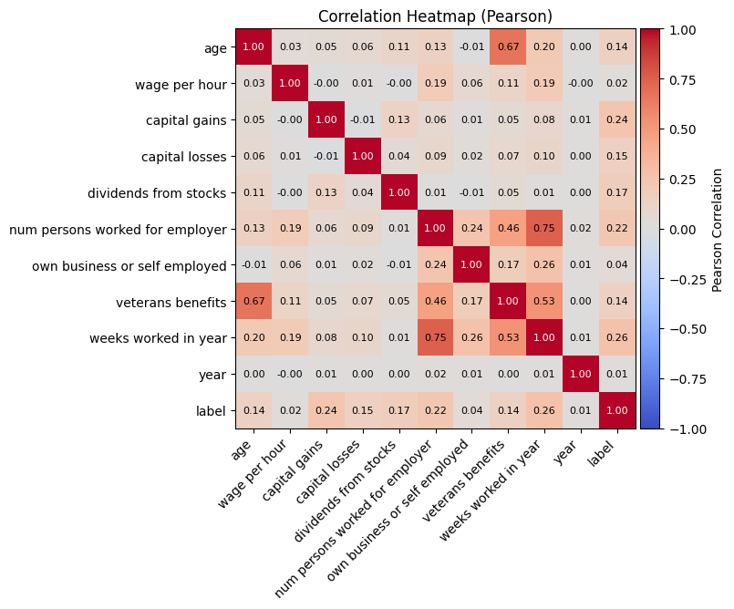

#### 3.1.3. Categorical Feature Relationships and Structure

In contrast, several categorical feature groups show clear structural relationships:

- **Occupation and industry features** (`detailed industry recode`, `detailed occupation recode`, `major industry code`, `major occupation code`) provide hierarchical employment information, with overlapping fine- and coarse-grained categories.

- **Geographic mobility features** (`migration code-change in msa`, `migration code-change in reg`, `migration code-move within reg`, `live in this house 1 year ago`, `migration prev res in sunbelt`) capture related aspects of residential stability and movement.

- **Household and family structure features** (`detailed household and family stat`, `detailed household summary in household`) represent closely linked aspects of household composition and dependency.

- **Demographic background features** (`country of birth self`, `country of birth father`, `country of birth mother`, `citizenship`) contain correlated information on immigration and generational status.

The following figure presents the Cramér's V association heatmap for the categorical variables:

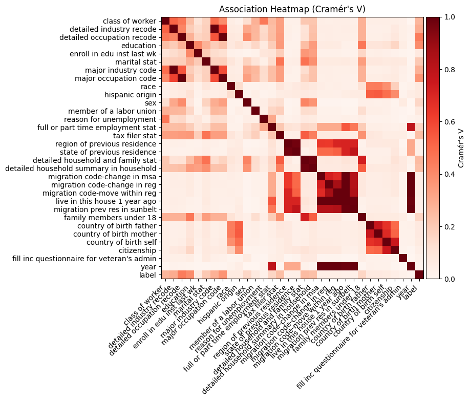

It is worth noting that `year` is highly correlated with several other categorical features, which is somewhat unexpected. Further investigation revealed that there is a distribution shift in some of the categorical variables from 1994 to 1995, primarily in the features capturing geography and migration. See [A.1.4. Temporal Distribution Shift](#a14-temporal-distribution-shift) for additional details.

The target variable shows its strongest associations with education and employment-related features, aligning with established socioeconomic patterns in income prediction.

Overall, these findings suggest that both classification and segmentation will be driven more by the structure of categorical variables than by linear relationships among numerical features.

### 3.2. Data Quality Assessment

This section describes key issues in the dataset related to duplicates, label ambiguity, missing values, and survey-specific response structures.

#### 3.2.1. Duplicate Patterns and Label Ambiguity

Because this is a survey-based dataset, each record represents a sampled individual and includes a sample weight used to make the data represent the U.S. population. As a result, many records can share identical feature values without being true duplicates.

Duplicate analysis identified three patterns:

1. **Fully identical records across all fields (including sample weight).** These represent exact duplicate rows in the dataset. Approximately 1.62% of records fall into this category. It is unclear whether they result from processing issues or valid repetition during data compilation. Since this cannot be determined, these records were retained.

2. **Partially identical records across fields (excluding sample weight).** These represent rows where all feature values are identical when ignoring the sample weight column. This is expected in Current Population Survey data, as different sampled individuals may share identical characteristics while still having different weights. Approximately 3.50% of records fall into this category. These cases are not considered duplicates and were retained.

3. **Identical records (excluding sample weight) with conflicting labels.** These cases occur when the same combination of features corresponds to differe outcomes, indicating ambiguity or noise in the feature-to-label mapping. This may reflect limitations in the available features, reporting variation, or noise in the survey process. Such instances are rare (approximately 0.19% of weighted observations) and represent a small portion of the dataset, suggesting they are unlikely to materially impact model performance.

Overall, most apparent duplicates are a natural consequence of the survey design rather than a data quality issue.

#### 3.2.2. Missing Values

The dataset contains relatively few missing values. The `hispanic origin` feature is the only attribute with truly missing values. This is notable, as the feature does not include an NIU category or any explicit indicator of non-Hispanic origin. Instead, the feature includes an `All other` category with a disproportionately high frequency. It is possible that non-Hispanic responses were grouped into this category, along with others of Hispanic origin that were too infrequent to be represented as separate categories.

Additionally, several features (primarily those related to immigration history, country of birth, and residence) contain categorical entries of `?`. This appears to represent unknown or unrecorded responses rather than a meaningful category. These values were treated as missing data and explicitly converted to a standard missing value representation during preprocessing to ensure consistent handling across the dataset.

See [A.1.1. Missing Values](#a11-missing-values) for additional details.

#### 3.2.3. Not in Universe Responses

The dataset contains a substantial number of "Not in Universe" (NIU) responses. These values indicate cases where a question was not applicable to a respondent, often due to survey skip logic rather than true missing data. NIU values are encoded using several different labels and appear across multiple features. Overall, these values are best interpreted as structural non-applicability indicators rather than missing data. For this reason, NIU values were retained as valid categorical states.

See [A.1.2. Not in Universe Values](#a12-not-in-universe-values) for additional details.

### 3.4. Feature Processing

The preprocessing strategy was applied consistently across both classification and segmentation pipelines. However, the feature subsets used for each task were different, reflecting differing objectives between the classification segmentation tasks.

#### 3.4.1. Categorical Features

Categorical features were processed using one-hot encoding, with missing values excluded from encoded categories. This ensured that unknown or invalid entries did not introduce artificial structure into the feature space. NIU indicators were also excluded from one-hot encoding to avoid unnecessary sparsity and redundancy. This decision is based on the fact that the absence of other category indicators effectively encodes the NIU state implicitly, making an explicit NIU indicator redundant in the transformed feature space.

#### 3.4.2. Numeric Features

Numerical features were standardized using z-score normalization to ensure comparable magnitude across features and improve model stability in both the classification and clustering tasks. While numeric missing values were theoretically possible, none were present in the dataset. The pipeline was, however, set up to impute missing numeric values using the median of the training data.

#### 3.4.3. Handling Sample Weights

The dataset includes a sample weight column representing the relative importance of each observation within the population. These weights were excluded from model training but were incorporated during model evaluation to ensure that performance metrics reflected population-level distributions rather than raw sample counts.

During classification, multiple weighting strategies were explored to address the substantial class imbalance. Regardless of the weighting scheme used during training, evaluation metrics were always computed using the original sample weights to better reflect the underlying population distribution.

Sample weights were not incorporated during segmentation due to limited support in the pipeline. However, they were applied during the visualization and analysis of the resulting groups.

## 4. The Classification Task

The classification component of this project focuses on predicting whether an individual falls into a low-income or high-income category based on demographic, economic, and socioeconomic attributes. This is formulated as a supervised learning problem, where the objective is to learn a mapping from observed features to income class labels.

The purpose of this task is to support targeted marketing decisions by enabling more efficient identification of high-income individuals. In doing so, it helps improve the precision of customer outreach and supports more effective allocation of marketing resources.

### 4.1. Feature Selection for Classification

Several features were excluded prior to modeling due to data quality concerns, redundancy, interpretability issues, or limited predictive value. This step was taken to improve robustness, reduce noise, and simplify the feature space.

* The `hispanic origin` feature was removed due to the presence of an `All other` category, which aggregates heterogeneous groups and introduces ambiguity.

* The `detailed occupation recode` and `detailed industry recode` features were excluded because they duplicate information already captured by higher-level categorical features (`major occupation code` and `major industry code`), introducing unnecessary redundancy.

* The `veterans benefits` and `detailed household and family stat` features were removed due to unclear semantic interpretation.

* The `family members under 18`, `region of previous residence`, and `state of previous residence` features were excluded due to a high proportion of NIU values, which reduces their reliability.

* Migration-related features (`migration code-change in msa`, `migration code-change in reg`, `migration code-move within reg`, and `migration prev res in sunbelt`) were excluded due to extensive missing values encoded as `?`, which limited their usefulness for modeling.

* Finally, `year` was removed due to minimal variation and lack of meaningful predictive signal.

To validate feature removal, feature importance analysis was performed. A LASSO logistic regression model was fitted on the full feature set, and coefficient magnitudes were examined. The following figure shows the feature coefficients under the LASSO logistic regression model:

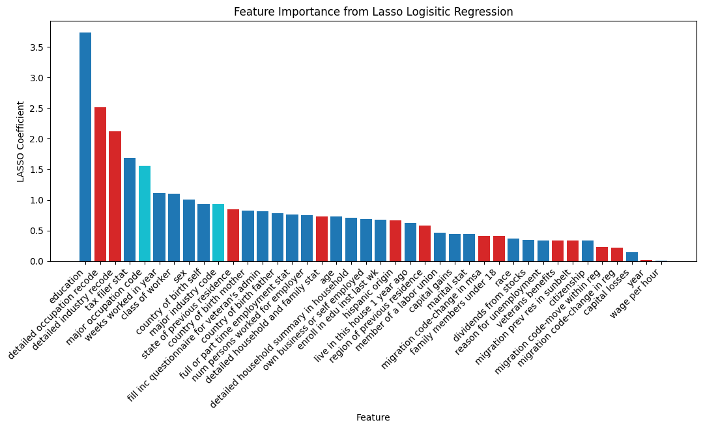

The `detailed occupation recode` and `detailed industry recode` features ranked among the most important features in the full model, which initially suggested that their removal could be problematic. However, these features are subcategories of `major occupation code` and `major industry code`, respectively. After removing the detailed-level features, the LASSO model redistributed importance toward the corresponding higher-level features. This indicates that predictive information was largely preserved, suggesting that the detailed features can be safely excluded without significant loss of signal. The following figure illustrates the feature importance after removing `detailed occupation recode` and `detailed industry recode`:

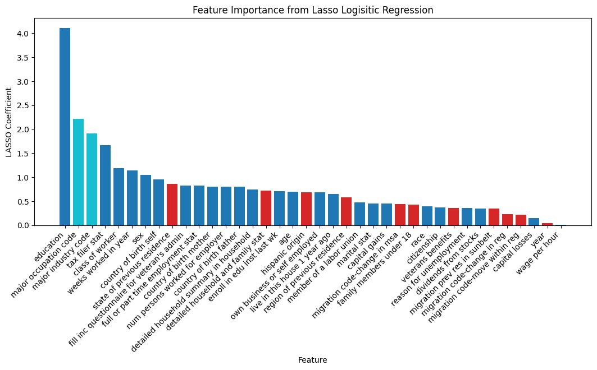

In addition, SHAP values from an XGBoost model were used to capture nonlinear effects and feature interactions. The following figure shows feature importance according to this model:

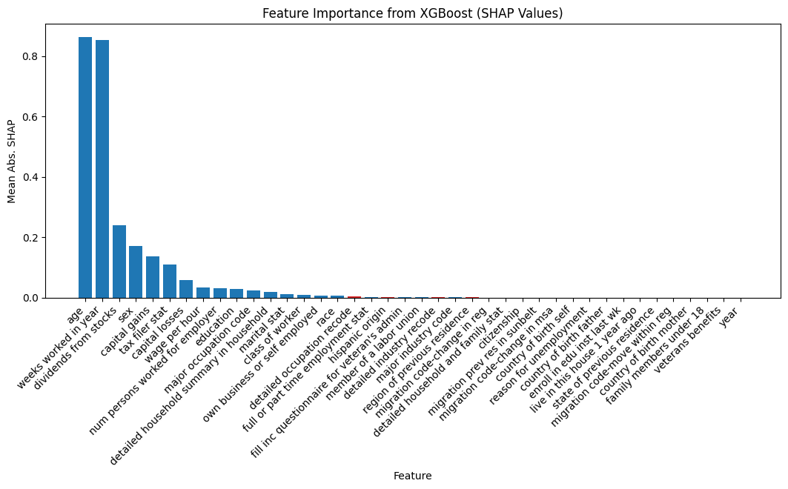

These results indicate that none of the excluded features contribute strongly under the XGBoost model.

Across both methods, the excluded features did not demonstrate strong or consistent predictive value, supporting their removal from the final modeling pipeline.

### 4.2. Classification Model Overview

Several supervised learning models were evaluated to classify individuals into income categories above or below $50,000 using demographic, economic, and socioeconomic features. The selected models were chosen to balance predictive performance with interpretability. This balance allows the resulting models to provide both accurate predictions and insights that may support targeted marketing and population analysis. Four models were considered:

- **Logistic Regression (Ridge and LASSO Regularization)** served as a strong linear baseline. These models provide interpretability and robustness in high-dimensional feature spaces, particularly where multicollinearity may be present.

- **Decision Tree (Gini Criterion)** was included as an interpretable nonlinear baseline capable of capturing feature interactions and producing explicit decision rules.

- **eXtreme Gradient Boosting (XGBoost)** was selected for its strong performance on structured tabular data and ability to capture complex nonlinear relationships with relatively limited feature engineering.

To address class imbalance, multiple weighting strategies were applied during training. However, all final evaluations were conducted using the original sample distribution to ensure that reported performance reflects the true population structure.

### 4.3. Training Strategies and Validation

Model performance was estimated using 5-fold stratified cross-validation to preserve class proportions across folds. Each model was trained using three different weighting strategies:

- **Original sample weights** use the survey-provided sample weights without modification, preserving the original survey structure.

- **Class-balanced weights (preserving within-class structure)** rescale sample weights so that each target class contributes equally to the training objective while maintaining relative weight differences among samples within the same class.

- **Fully uniform class weights** rescale sample weights so that each target class contributes equally to the training objective, with all samples within a class assigned the same weight.

These strategies were chosen to assess the impact of different approaches to handling class imbalance on model performance.

### 4.4. Evaluation Metrics

Due to the substantial class imbalance in the dataset, accuracy alone is not an appropriate evaluation metric. Instead, multiple metrics were used to assess different aspects of classification performance:

* **ROC-AUC** measures the model's ability to discriminate between income classes across classification thresholds.

* **F1 score** provides a balanced measure of precision and recall for the positive class.

* **Precision and recall** evaluate the model's effectiveness in identifying high-income individuals while accounting for false positive and false negative predictions.

* **Specificity and negative predictive value** assess performance on the majority class by measuring the correct identification and reliability of negative predictions.

* **Accuracy** is reported for completeness but is not used as a primary model selection criterion due to the class imbalance.

Together, these metrics provide a more comprehensive assessment of model performance than accuracy alone and allow the effects of different class-imbalance handling strategies to be evaluated.

### 4.5. Classification Performance Results

The following plots summarize the 5-fold cross-validated performance (mean $\pm$ standard deviation) of each classification model under the three weighting strategies. Performance estimation was conducted using the original sample weights to ensure that reported metrics reflect the underlying population distribution. For further details, see [A.2. Detailed Classification Performance Results](#a2-detailed-classification-performance-results).

Across all strategies, XGBoost consistently achieved the strongest overall performance, particularly in terms of ROC-AUC, F1 score, precision, and accuracy. Logistic regression models showed similar ROC-AUC performance, while the decision tree model generally underperformed.

#### 4.5.1. Original Sample Weights

Under the original weighting scheme, models were trained using the unmodified sample weights. The figure below summarizes the resulting 5-fold cross-validated performance across all models and metrics.

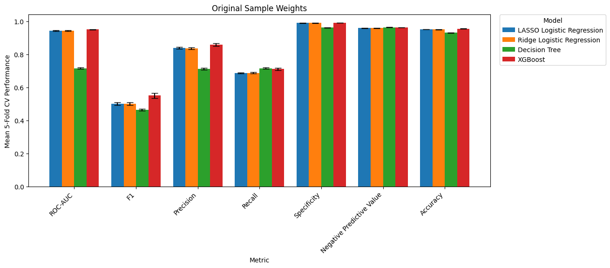

Logistic regression models achieve strong ROC-AUC and high specificity, indicating good class separation and reliable identification of the majority class. However, recall for the minority class is comparatively lower, limiting overall balanced performance.

The decision tree exhibits weaker discriminative ability, as reflected by lower ROC-AUC, but achieves slightly higher recall than logistic regression at the expense of reduced precision.

XGBoost provides the best overall trade-off, achieving the highest ROC-AUC, F1 score, precision, specificity, and accuracy, while maintaining competitive recall.

#### 4.5.2. Class-Balanced Weights (Preserving Within-Class Structure)

Under class-balanced weighting, class contributions were equalized while preserving relative variation within each class. The figure below summarizes the resulting 5-fold cross-validated performance across all evaluated models and metrics.

Compared to the original weighting scheme, class-balanced weighting increases recall across all models, most notably for logistic regression and XGBoost. This improvement is accompanied by reductions in precision and F1 score, while ROC-AUC remains largely unchanged, indicating stable ranking performance.

#### 4.5.3. Fully Uniform Class Weights

Under fully uniform weighting, each class was assigned equal total weight, with uniform weights within classes. The figure below summarizes the resulting 5-fold cross-validated performance across all evaluated models and metrics.

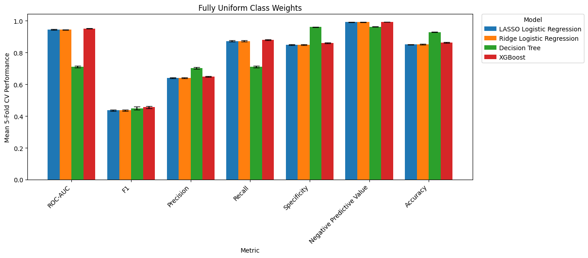

Results under fully uniform weighting closely mirror those observed under the original weighting scheme. Logistic regression and XGBoost again exhibit higher recall at the expense of reduced precision and accuracy, while ROC-AUC remains stable across all models. The decision tree shows comparatively lower ROC-AUC but higher specificity and accuracy relative to the linear models.

#### 4.5.4. Effect of Weighting Scheme on Model Performance

Overall, ROC-AUC, specificity, negative predictive value, and accuracy are relatively insensitive to the choice of weighting strategy. Specificity and accuracy are generally slightly higher under the original sample weights, whereas negative predictive value is marginally lower under this weighting scheme.

In contrast, F1 score is more sensitive to the weighting strategy. For most models, the original sample weights yield lower F1 scores compared to the alternative weighting strategies. The primary exception is the decision tree model, for which the original sample weights produce a noticeably higher F1 score.

Precision and recall show a complementary pattern. The original sample weights generally lead to higher precision across models, while alternative weighting strategies tend to reduce precision but increase recall. The decision tree model again deviates slightly from this pattern, with recall remaining largely stable across weighting strategies.

Detailed plots can be found in [A.2.2. Performance Grouped by Evaluation Metric](#a22-performance-grouped-by-evaluation-metric).

#### 4.5.5. Summary of Performance Results

Overall, the models demonstrate strong discriminatory performance despite a significant class imbalance. ROC-AUC values are consistently high across all weighting strategies, which indicate that all models are effective at ranking observations.

Model performance is highly stable across weighting strategies in terms of ranking. XGBoost consistently achieves the strongest performance across most metrics, followed closely by the logistic regression models, while the decision tree underperforms across all configurations.

Under the original sample weighting, XGBoost achieves the strongest overall balance of performance, leading in ROC-AUC, precision, F1 score, specificity, and accuracy. Logistic regression performs similarly in terms of ROC-AUC but exhibits a weaker precision–recall balance. The decision tree consistently lags behind the other models, although it shows relatively competitive recall in some settings.

Introducing class weighting strategies has a limited effect on ROC-AUC, indicating that model ranking ability remains unchanged. However, weighting substantially shifts the precision–recall trade-off. Balanced and uniform weighting strategies increase recall across most models, but this comes at the cost of reduced precision and, in many cases, lower F1 scores. The original weighting strategy therefore tends to favor higher precision, while alternative strategies favor higher recall.

The divergence between ROC-AUC and threshold-dependent metrics highlights the effect of class imbalance. While ROC-AUC indicates strong separability between classes, precision, recall, and F1 reveal meaningful differences in classification behavior depending on the chosen weighting strategy.

**Key takeaway:** The models are strong at separating the classes but only moderately effective as fixed-threshold classifiers, with performance constrained by a precision–recall trade-off under severe class imbalance.

### 4.6. Model Interpretability and Key Drivers of Income

This section focuses on model interpretability and identifies the most influential features associated with income classification. Logistic regression models are particularly suitable for this analysis due to their direct relationship between feature coefficients and log-odds, allowing for straightforward interpretation of directional effects.

The following subsections present the key positive and negative drivers of income as identified by the LASSO and Ridge logistic regression models. Overall, both models show a highly consistent structure, with education level, occupational category, and work intensity emerging as the dominant predictors of higher income.

#### 4.6.1. LASSO Logistic Regression

The LASSO logistic regression model performs both regularization and feature selection by driving less informative coefficients toward zero. As a result, it produces a more compact and interpretable representation of the most influential predictors. The tables below give the top 5 most influential positive and negative predictors of income identified by the model, based on coefficient magnitude and corresponding odds ratios.

##### Positive Drivers

| Feature                                                    | Feature Type   |   Coefficient |   Odds Ratio |
|:-----------------------------------------------------------|:---------------|--------------:|-------------:|
| `education` = "Doctorate degree(PhD EdD)"                  | categorical    |      $2.1139$ |     $8.2802$ |
| `education` = "Prof school degree (MD DDS DVM LLB JD)"     | categorical    |      $2.0132$ |     $7.4872$ |
| `education` = "Masters degree(MA MS MEng MEd MSW MBA)"     | categorical    |      $1.2953$ |     $3.6522$ |
| `weeks worked in year`                                     | numeric        |      $1.1160$ |     $3.0527$ |
| `major occupation code` = "Executive admin and managerial" | categorical    |      $0.9465$ |     $2.5768$ |

##### Negative Drivers

| Feature                                   | Feature Type   |   Coefficient |   Odds Ratio |
|:------------------------------------------|:---------------|--------------:|-------------:|
| `tax filer stat` = "Nonfiler"             | categorical    |     $-1.7026$ |     $0.1822$ |
| `sex` = "Female"                          | categorical    |     $-1.4669$ |     $0.2306$ |
| `education` = "10th grade"                | categorical    |     $-1.1399$ |     $0.3199$ |
| `major industry code` = "Social services" | categorical    |     $-1.0559$ |     $0.3479$ |
| `education` = "5th or 6th grade"          | categorical    |     $-1.0452$ |     $0.3516$ |

Higher education is the strongest positive predictor of high income, particularly advanced degrees such as doctorates, professional degrees, and master's degrees. Greater workforce participation, measured by weeks worked in a year, and employment in executive, administrative, and managerial occupations are also strongly associated with higher income. In contrast, non-filing tax status is the strongest negative predictor of income, followed by `sex = "Female"`. Lower levels of educational, specifically `10th grade` and `5th or 6th grade`, are likewise associated with lower income, along with employment in the social services industry.

#### 4.6.2. Ridge Logistic Regression

The Ridge logistic regression model provides a regularized linear baseline that retains all features while shrinking coefficients to reduce multicollinearity effects. This makes it well-suited for understanding broad patterns of influence across correlated features. Unlike LASSO, Ridge does not perform feature selection, meaning all variables remain in the model, but their coefficients are pushed toward zero. This allows for a more global view of how features contribute to income prediction, particularly in the presence of correlated features. The tables below summarize the top 5 most influential positive and negative predictors of income based on coefficient magnitude and corresponding odds ratios.

##### Positive Drivers

| Feature                                                | Feature Type   |   Coefficient |   Odds Ratio |
|:-------------------------------------------------------|:---------------|--------------:|-------------:|
| `education` = "Doctorate degree(PhD EdD)"              | categorical    |      $2.1779$ |     $8.8277$ |
| `education` = "Prof school degree (MD DDS DVM LLB JD)" | categorical    |      $2.0964$ |     $8.1371$ |
| `education` = "Masters degree(MA MS MEng MEd MSW MBA)" | categorical    |      $1.3626$ |     $3.9064$ |
| `weeks worked in year`                                 | numeric        |      $1.1021$ |     $3.0104$ |
| `country of birth self` = "Scotland"                   | categorical    |      $1.0168$ |     $2.7644$ |

##### Negative Drivers

| Feature                                  | Feature Type   |   Coefficient |   Odds Ratio |
|:-----------------------------------------|:---------------|--------------:|-------------:|
| `tax filer stat` = "Nonfiler"            | categorical    |     $-1.7665$ |     $0.1709$ |
| `sex` = "Female"                         | categorical    |     $-1.5034$ |     $0.2224$ |
| `education` = "5th or 6th grade"         | categorical    |     $-1.4235$ |     $0.2409$ |
| `education` = "9th grade"                | categorical    |     $-1.0730$ |     $0.3420$ |
| `education` = "1st 2nd 3rd or 4th grade" | categorical    |     $-1.0533$ |     $0.3488$ |

The strongest positive predictors identified by the Ridge logistic regression model are largely consistent with those observed in the LASSO model, particularly the strong influence of advanced educational degrees and weeks worked in a year. One notable difference is the appearance of `country of birth self = "Scotland"` among the top positive predictors. On the negative side, the Ridge model highlights many of the same influential features as LASSO, including non-filing tax status, lower educational levels, and `sex = "Female"`, although the relative magnitudes and rankings of these predictors differ slightly.

#### 4.6.3. Decision Tree (Gini Importance)

The decision tree model ranks features using Gini importance, which measures the total reduction in node impurity attributed to each feature across all splits. Unlike the logistic regression models, Gini importance does not indicate how a feature affects the predicted class; instead, it measures how useful the feature is for separating the classes during the tree-building process. Features used in splits that produce greater class separation are assigned higher importance values. This measure reflects how the model uses features internally during training and is sensitive to the structure of the learned tree. The table below shows the top 10 features, ranked by their Gini importance values.

| Feature                                                    | Feature Type   |   Gini Importance |
|:-----------------------------------------------------------|:---------------|------------------:|
| `age`                                                      | numeric        |          $0.1266$ |
| `capital gains`                                            | numeric        |          $0.1264$ |
| `dividends from stocks`                                    | numeric        |          $0.0993$ |
| `weeks worked in year`                                     | numeric        |          $0.0713$ |
| `sex` = "Male"                                             | categorical    |          $0.0315$ |
| `capital losses`                                           | numeric        |          $0.0262$ |
| `major occupation code` = "Professional specialty"         | categorical    |          $0.0221$ |
| `major occupation code` = "Executive admin and managerial" | categorical    |          $0.0203$ |
| `wage per hour`                                            | numeric        |          $0.0132$ |
| `live in this house 1 year ago` = "Yes"                    | categorical    |          $0.0130$ |

The results indicate that the model relies most heavily on financial-related features such as capital gains, dividends from stocks, and capital losses. These variables are frequently used in decision splits that produce strong class separation within the training data. Age and employment-related variables, such as weeks worked in a year, also contribute meaningfully to the model's predictive structure. Categorical features, such as sex and occupation, appear with lower importance while still contributing to decision boundaries in specific regions of the feature space.

#### 4.6.4. XGBoost (SHAP)

The XGBoost model was interpreted using SHAP (SHapley Additive exPlanations) values, which measure how much each feature contributes to a prediction. For every observation, SHAP assigns a value to each feature indicating whether it increases or decreases the predicted probability of the positive class compared to the model's baseline prediction. Positive SHAP values push predictions toward higher income, while negative SHAP values push predictions toward lower income.

SHAP values provide a detailed view of potentially complex, nonlinear relationships between features and model predictions. However, the primary goal of this analysis is to identify which features have the greatest overall influence on the model's predictions. To summarize each feature's impact with a single metric, the absolute SHAP values were averaged across all observations. Features with larger mean absolute SHAP values have a greater overall influence on the model's predictions, regardless of whether that influence is positive or negative. The table below shows the top 10 features, ranked by their mean absolute SHAP values.

| Feature                                                    | Feature Type   |   Mean Abs SHAP |
|:-----------------------------------------------------------|:---------------|----------------:|
| `weeks worked in year`                                     | numeric        |        $0.9093$ |
| `age`                                                      | numeric        |        $0.8947$ |
| `tax filer stat` = "Nonfiler"                              | categorical    |        $0.5988$ |
| `sex` = "Female"                                           | categorical    |        $0.3032$ |
| `dividends from stocks`                                    | numeric        |        $0.2350$ |
| `capital gains`                                            | numeric        |        $0.1438$ |
| `education` = "Bachelors degree(BA AB BS)"                 | categorical    |        $0.1435$ |
| `detailed household summary in household` = "Householder"  | categorical    |        $0.1407$ |
| `num persons worked for employer` = "6"                    | categorical    |        $0.1309$ |
| `major occupation code` = "Executive admin and managerial" | categorical    |        $0.1183$ |

The results suggest that the XGBoost model places meaningful weight on financial variables such as stock dividends and capital gains, though these factors are less dominant than in the decision tree model. Demographic characteristics—especially age and sex—play a particularly strong role in the model’s predictions. Tax filing status also reappears as a key predictor with substantial influence.

Educational attainment remains an important feature as well, but XGBoost shows a distinct emphasis on individuals with a bachelor’s degree. This contrasts with the other models, which tended to assign greater importance to graduate or professional degrees, as well as to categories associated with individuals who did not complete high school.

#### 4.6.5. Summary of Key Drivers

Across all models, a consistent pattern of predictors has emerged. Higher educational levels (e.g., master's, professional, and doctoral degrees), greater work intensity (weeks worked in a year), and higher-status occupations increase the chances of belonging to the high-income class. In contrast, lower education levels, non-filing tax status, and being female are consistently associated with lower predicted income. Financial variables such as capital gains, dividends, and capital losses are also highly influential, particularly in the decision tree, where they dominate the top splits. While each model differs slightly in emphasis:

- LASSO and Ridge logistic regression are more focused on education and occupation  
- Decision tree highlights demographic, occupational, and financial features
- XGBoost has a broader focus, incorporating educational features in addition to demographic, occupational, and financial features

the overlap in key features indicates a stable underlying structure in the data.

Overall, these results align closely with expectations about income. Education and work experience, labor market engagement, and investments are expected to be strong positive drivers, while limited education and weaker labor market engagement are known to correspond with lower income. The consistency across the models suggests that these relationships are not artifacts, but instead reflect real patterns in the dataset. At the same time, some model-specific signals (such as country of birth effects or certain employment categories in XGBoost) indicate additional structure that is only captured when complicated interactions and nonlinearities are allowed.

## 5. The Segmentation Task

The segmentation component of this project aims to find meaningful groups of individuals with similar demographic, economic, and socioeconomic characteristics. Unlike the supervised classification task, this is an exploratory analysis with no predefined target labels. The goal is to uncover the underlying structure of the population by grouping individuals based on observed similarities across multiple features.

The objective is to produce clear and interpretable segments that reflect real differences in demographic background, economic outcomes, and socioeconomic status, which can then be used for practical applications such as targeted marketing, customer prioritization, and product positioning. The desired segmentation approach should provide:

- The flexibility to identify segments without imposing equal group sizes.
- Support for segments that vary naturally in size and density.
- The ability to capture irregular (non-spherical) segment shapes.
- A mechanism for treating individuals with unclear segment membership as noise rather than forcing assignment.

### 5.1. Feature Selection for Segmentation

Rather than using the full feature space, a focused subset of features was selected to improve interpretability, reduce noise, and produce more stable and meaningful clusters. The segmentation features were chosen to capture three complementary aspects of the population:

**Demographic Features:**
- `age`
- `sex`
- `race`
- `marital stat`
- `country of birth self`
- `family members under 18`

**Economic Features:**
- `wage per hour`
- `capital gains`
- `capital losses`
- `dividends from stocks`

**Socioeconomic Features:**
- `education`
- `class of worker`
- `major occupation code`
- `major industry code`

This feature design helps the clustering focus on real differences in the population instead of just picking up repeated or overlapping information in the full dataset.

### 5.2. Dimensionality Reduction (UMAP)

Uniform Manifold Approximation and Projection (UMAP) was used to project the selected feature space into a lower-dimensional representation suitable for clustering. This step is necessary because the processed dataset is high-dimensional and sparse due to one-hot encoding of categorical features. In such spaces, direct distance-based clustering becomes less meaningful, as points tend to appear similarly distant from one another. UMAP addresses this by learning a lower-dimensional representation that preserves local neighborhood structure, ensuring that individuals who are similar in the original feature space remain close together in the embedding.

The cosine distance metric was chosen because the feature space contains many binary one-hot encoded features, where similarity is better captured by the angle between vectors (shared active features) rather than absolute magnitude or Euclidean distance, which can be misleading in sparse spaces.

### 5.3. The Clustering Method (HDBSCAN)

Hierarchical Density-Based Spatial Clustering of Applications with Noise (HDBSCAN) was applied to the UMAP embedding to identify dense regions corresponding to meaningful population segments. HDBSCAN was selected because it does not require predefining the number of clusters and can naturally handle variable cluster sizes, irregular cluster shapes, and noise points that do not belong to any segment. This is particularly important for census-based population data, where strict geometric assumptions (e.g., spherical clusters) may not be realistic.

### 5.4. Cluster Analysis

After applying HDBSCAN to the UMAP embedding, 28 clusters were identified. To characterize these clusters, the distributions of the original features were examined within each group. Because HDBSCAN does not impose a predefined cluster structure, interpretation relies on post hoc analysis of feature distributions and their differences across clusters.

**Cluster -1: Noise.** This cluster contains individuals that HDBSCAN has labeled as noise. It includes a large proportion of children, with an age distribution that is heavily skewed toward much younger ages compared to the other clusters.

**Cluster 0: Male Children Artifact.** All individuals in this cluster are 10 years old and male, with no labor force participation. This cluster is an artifact of the clustering process, as there is no variability across the features used for segmentation.

**Clusters 1 and 2: Teen Workers.** Almost all individuals in these clusters are in high school (9th through 12th grade), with a large proportion working in retail.  
- Cluster 1 includes a single individual who is 26 years old. This cluster is almost entirely female (~99%), with only 3 males. 
- Cluster 2 is mostly male (~90%).

**Cluster 3: Unstable Working Class.** These individuals work across a wide range of industries and occupations and have diverse educational backgrounds. The cluster is mostly male (~72%) with a smaller proportion of females (~28%). What distinguishes this group is that all members report substantial capital losses, a feature not observed in any other cluster.

**Cluster 6: Agriculture Workers.** The majority of these individuals work in the agriculture industry (~89%), with an overwhelming number employed in farming, forestry, and fishing (~98%).

**Clusters 7 and 13: Retired.** These two clusters have a larger proportion of older individuals than all other clusters (heavier tails above age 60). Both also show a small amount of capital gains income (slightly more than most other clusters).
- Cluster 7 is about half male and half female, with many not working (~75%), and includes dividend income from stocks.
- Cluster 13 is almost entirely male (~94%), with 100% not working.

**Clusters 9, 10, 11, and 12: Unemployed or Inactive.** All individuals in these clusters are unemployed.
- Cluster 9 is almost entirely AAPI (~98%) and has the largest share of foreign-born individuals among all clusters.
- Cluster 10 is composed entirely of females.
- Cluster 11 is composed entirely of African American males.
- Cluster 12 has an older age distribution than the other three clusters, with a heavier concentration of individuals above age 60 (i.e., retirement age). However, it also includes a substantial number of working-age individuals. This cluster is composed entirely of males.

**Cluster 14: Investment Oriented.** This cluster contains a large proportion of individuals employed in executive, administrative, and managerial occupations (~38%), as well as professional specialty occupations (~32%). It is distinguished by substantially higher capital gains than any other cluster.

**Cluster 15: Private-Sector Sales Workers.** This cluster consists almost entirely of private-sector employees and is overwhelmingly concentrated in sales occupations (~99%). The primary industry is retail trade (about 47%), followed by wholesale trade (~23%) and finance, insurance, and real estate (~13%). The cluster is almost entirely male.

**Clusters 16, 17, and 18: Government Workers.** These clusters are composed primarily of individuals employed by the federal, state, and local governments.
* Cluster 16 consists entirely of federal government workers (~99%). A majority work in public administration (~59%), followed by transportation (~32%). A substantial share are employed in administrative and clerical support occupations (~37%), with a smaller proportion working in executive, administrative, and managerial roles (~19%).
* Cluster 17 is predominantly composed of state government workers (~86%), with a small proportion of local government employees (~13%). These individuals work primarily in the public administration (~45%) and education industries (~44%). They are employed mainly in professional specialty occupations (~38%), protective services (~17%), and executive, administrative, and managerial roles (~14%).
* Cluster 18 consists entirely of local government workers. These individuals are employed mostly in public administration (~47%), education (~29%), and utilities and sanitary services (~14%) industries. Their occupations include protective services (~32%), executive, administrative, and managerial roles (~17%), precision production, craft, and repair (~12%), and other services (~12%).

**Cluster 19: Executives and Managers.** This cluster is almost entirely executive, administrative, and managerial occupations (~100%).

**Cluster 20: Self-Employed Sales Workers.** This cluster is composed of both self-employed incorporated (38%) and self-employed unincorporated (61%) individuals. The primary industry is retail trade (~49%), followed by wholesale trade (~23%) and finance, insurance, and real estate (~24%). Most individuals are in sales occupations (~97%).

**Cluster 21: Independent Contractors and Trades Workers.** This cluster consists almost entirely of self-employed, unincorporated individuals (~100%). The primary industry is construction (~47%), followed by business and repair services (~22%). The majority of these individuals work in precision production, craft, and repair occupations (~54%), with a smaller proportion in executive, administrative, and managerial roles (~33%).

**Cluster 22: Professional Specialists.** These individuals are almost all professional specialists (~98%). This cluster has a much larger proportion of college-educated individuals (~35% with bachelor's degrees and ~21% with master's degrees) compared to most other clusters, and a much smaller share of individuals with only a high school education compared to most other clusters.

**Clusters 23 and 26: Skilled Trades / Production and Labor.** A large share of individuals in these clusters work in manufacturing industries.
* Cluster 23 consists almost entirely of workers employed in precision production, craft, and repair occupations (~100%).
* Cluster 26 is composed almost entirely of machine operators, assemblers, and inspectors (~63%), with a small share employed as handlers and equipment cleaners (~37%).

**Cluster 27: Transportation.** The largest industry represented in this cluster is transportation (~47%), with an overwhelming number of occupations belonging to transportation and material moving (~93%).

This section contains cluster-level summaries and visualizations of the categorical features used in the segmentation model. It focuses on understanding how discrete attributes are distributed across clusters and how these distributions differ between segments.

See [A.3 Supporting Figures for Segmentation](#a3-supporting-figures-for-segmentation) for cluster-level visualizations of the features used to interpret the segmentation results.

## 6. Limitations and Ethical Considerations

In this section, we outline key limitations of the modeling approaches and data used, along with important ethical considerations that arise from predictive modeling and unsupervised segmentation in a socioeconomic context.

### 6.1. Temporal Limitations and Concept Drift

The dataset originates from 1994-1995, and so relationships between features and income may not translate well to modern settings due to concept drift over time and how socioeconomic factors influence earnings. Additionally, several feature definitions and coding systems (e.g., occupation and industry classifications) have evolved since the 1990s. This makes direct application to contemporary data challenging without careful alignment of feature encodings.

### 6.2. Sampling Bias and Representativeness

Although sample weights are applied, the dataset may still not fully capture the diversity of the general population. Certain subgroups may be underrepresented or aggregated into broad categories, which can introduce bias and reduce granularity. Therefore, it may be safer to interpret the results as broad population-level patterns rather than precise individual-level predictions.

### 6.3. Limited Feature Information

The dataset is limited to demographic, employment, and socioeconomic features. It does not include behavioral, transactional, or digital information, such as:

* lifestyle habits (e.g., exercise frequency, sleep duration)
* purchasing history (e.g., online shopping records, subscription purchases)
* financial transactions (e.g., credit card payments, bank transfers)
* digital activity (e.g., social media usage)

The available features were sufficient to segment customers and predict high versus low income groups. However, because the dataset lacks behavioral and transactional data, the resulting segments are less detailed and harder to interpret, and predictive performance is limited. This reduces the accuracy and practical usefulness of the models for real-world marketing applications, as tasks such as targeted advertising and personalized recommendations often rely on detailed spending and behavioral data, which this dataset does not include.

### 6.4. Fairness and Ethical Considerations

Income prediction models may reinforce existing societal biases present in historical census data. Even when sensitive attributes are removed, many remaining features (such as education, occupation, and geography) can act as proxies for protected characteristics, leading to indirect discrimination.

Similarly, clustering-based segmentation can unintentionally reproduce socially meaningful groupings, since individuals are grouped based on shared socioeconomic and demographic patterns. As a result, clusters may reflect underlying structural inequalities rather than neutral population structure. This is evident in the clusters produced by HDBSCAN, some of which exhibit strong demographic homogeneity. These risks highlight the importance of interpreting both predictive and segmentation outputs cautiously, particularly when used in real-world targeting or decision-making contexts.

### 6.5. Limitations of Clustering and Segment Assignment  

The segmentation approach relies on UMAP for dimensionality reduction and HDBSCAN for clustering. A key limitation is that this pipeline does not naturally support out-of-sample assignment of new individuals to existing clusters. Although UMAP can project new observations into the existing embedding space, HDBSCAN does not provide a fully native predictive mapping for cluster assignment. As a result, new observations cannot be directly mapped to predefined segments in a fully consistent way without additional methods. This limitation is further compounded by potential changes in the underlying data distribution over time, which may affect both the embedding structure and cluster definitions.

## 7. Potential Improvements and Future Work

There are several clear directions for extending and strengthening the current work. One key limitation is that no systematic hyperparameter optimization was carried out for either the classification or clustering models. Introducing structured tuning methods such as grid search could improve predictive accuracy and may produce more reliable and stable cluster assignments.

Another important extension involves fairness assessment. Since income prediction and marketing segmentation can be sensitive to demographic disparities, future work should include formal fairness metrics and, where appropriate, fairness-aware modeling techniques to evaluate and reduce potential bias across different groups.

Although exploratory analysis of feature distributions suggested overall consistency, a few of the features showed noticeable distributional shifts from 1994 to 1995. These differences may reflect temporal shifts, data quality issues, or inconsistencies in collection procedures. A more rigorous investigation into these patterns, including improved cleaning and validation steps, would help clarify their impact. See [A.1.4. Temporal Distribution Shift](#a14-temporal-distribution-shift) for further details.

A further limitation is the restricted domain understanding of census variables, which made interpretation of some features less precise. Incorporating domain expertise or consulting detailed documentation more thoroughly would likely enhance both feature engineering and interpretability of the results.

SHAP analysis was applied to identify important predictors of income, but the explanations primarily captured additive effects and did not fully expose more complex feature interactions. Extending this work to include SHAP interaction values and subgroup-level explainability could provide deeper insight into nonlinear relationships and heterogeneous effects across different populations.

Overall, future work should prioritize improved hyperparameter tuning, more rigorous fairness evaluation, stronger domain-informed interpretation, and more advanced explainability techniques to better understand both predictive mechanisms and clustering structure.

## 8. Conclusion

This project examined income prediction and population segmentation using U.S. Census Current Population Survey data. The work combined a supervised classification task to predict income level with an unsupervised clustering approach to identify meaningful subgroups in the population.

For classification, all models achieved strong discriminative performance, with XGBoost performing best overall and logistic regression offering competitive accuracy with greater interpretability. While weighting strategies mainly affected the precision-recall trade-off, they had little impact on ranking ability, as shown by consistently high ROC-AUC values across models. Across all approaches, a stable set of key predictors emerged. Education level, occupational category, work intensity, and financial variables such as capital gains and dividends were consistently associated with higher income, while lower education, weaker labor force participation, and tax non-filing were associated with lower income.

The segmentation analysis produced interpretable clusters reflecting real-world population structure, including groups defined by occupation, employment status, and life stage. These results demonstrate that meaningful structure can be recovered from the data without predefined labels.

Overall, the findings show that income patterns in the dataset are strongly structured and can be effectively modeled and segmented, while also highlighting limitations related to temporal relevance, bias, and interpretability in applied settings.

## Appendix A: Supporting Figures and Tables

### A.1 Exploratory Data Analysis

#### A.1.1. Missing Values

The dataset contains actual missing values only in the `hispanic origin` feature. However, several other features use the value `?` to represent unknown or missing data. These entries were treated as missing values in the analysis. The table below shows the weighted percentage of missing values (including `?`) for all affected features.

| Feature                          |   Percentage (%) |
|:---------------------------------|-----------------:|
| `migration code-change in msa`   |          $50.30$ |
| `migration code-move within reg` |          $50.30$ |
| `migration prev res in sunbelt`  |          $50.30$ |
| `migration code-change in reg`   |          $50.30$ |
| `country of birth father`        |           $3.22$ |
| `country of birth mother`        |           $2.94$ |
| `country of birth self`          |           $1.65$ |
| `hispanic origin`                |           $0.47$ |
| `state of previous residence`    |           $0.45$ |

The figure below shows the same missing data pattern across features.

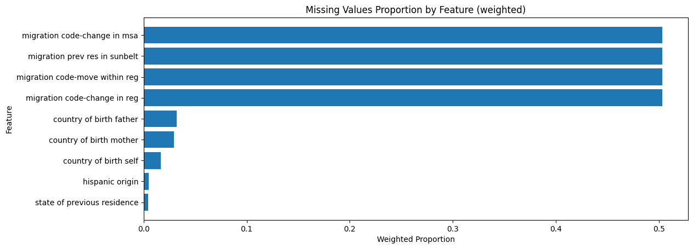

#### A.1.2. Not in Universe Values

The dataset contains NIU (Not in Universe) responses, indicating that a question was not applicable to certain respondents, likely due to survey skip logic. These values should not be treated as missing data, as they represent structural absence rather than non-response. Different columns use different representations for NIU values; however, the representation is consistent within each column. The following table summarizes the NIU categories used and their weighted percentages:

| Feature                                      | NIU Indicator Value              |   Percentage (%) |
|:---------------------------------------------|:---------------------------------|-----------------:|
| `fill inc questionnaire for veteran's admin` | Not in universe                  |          $99.00$ |
| `reason for unemployment`                    | Not in universe                  |          $96.79$ |
| `enroll in edu inst last wk`                 | Not in universe                  |          $93.45$ |
| `region of previous residence`               | Not in universe                  |          $91.76$ |
| `state of previous residence`                | Not in universe                  |          $91.76$ |
| `member of a labor union`                    | Not in universe                  |          $90.10$ |
| `family members under 18`                    | Not in universe                  |          $73.36$ |
| `full or part time employment stat`          | Children or Armed Forces         |          $61.31$ |
| `live in this house 1 year ago`              | Not in universe under 1 year old |          $51.07$ |
| `major industry code`                        | Not in universe or children      |          $49.44$ |
| `major occupation code`                      | Not in universe                  |          $49.44$ |
| `class of worker`                            | Not in universe                  |          $49.21$ |
| `migration prev res in sunbelt`              | Not in universe                  |          $41.45$ |
| `migration code-change in msa`               | Not in universe                  |           $0.77$ |
| `migration code-change in reg`               | Not in universe                  |           $0.77$ |
| `migration code-move within reg`             | Not in universe                  |           $0.77$ |

The figure below shows the same NIU data pattern across features.

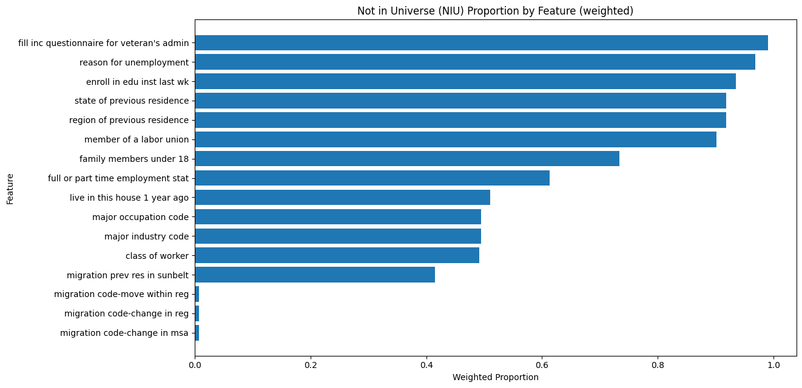

#### A.1.3. Target Distribution and Class Imbalance

The target variable exhibits a substantial class imbalance. In the unweighted data, the negative class accounts for 187,141 observations (93.79%), while the positive class accounts for 12,382 observations (6.21%). This imbalance remains essentially unchanged after applying survey weights. In the weighted data, the negative class represents 93.59% of the total weighted population, compared with 6.41% for the positive class. The close agreement between the weighted and unweighted distributions indicates that the weighting scheme does not materially affect the overall class balance.

| Label      |    Count |   Percentage (%) |   Weighted Count |   Weighted Percentage (%) |
|:-----------|---------:|-----------------:|-----------------:|--------------------------:|
| `- 50000.` | $187141$ |        $93.7942$ |   $325004647.22$ |                 $93.5950$ |
| `50000+.`  |  $12382$ |         $6.2058$ |    $22241245.25$ |                  $6.4050$ |

#### A.1.4. Temporal Distribution Shift

To assess whether the data changes between 1994 and 1995, feature distributions were compared across the two years. For numeric features, the Kolmogorov-Smirnov test and Cohen's $d$ were used to measure differences in distributions and means. For categorical features, Chi-square tests and Cramér's V were used to measure changes in category distributions.

The following table shows that numeric features are stable over time. All effect sizes are close to zero, and any statistically significant differences are very small, thus indicating no meaningful change in distribution between years.

| Feature                 |   KS Statistic |   p-value |   Cohen's d |   Mean (Year 1) |   Mean (Year 2) |   Mean Shift | Severity   |
|:------------------------|---------------:|----------:|------------:|----------------:|----------------:|-------------:|:-----------|
| `weight`                |       $0.0203$ |  $0.0000$ |   $-0.0235$ |       $1728.70$ |       $1752.08$ |     $-23.38$ | None       |
| `weeks worked in year`  |       $0.0064$ |  $0.0337$ |   $-0.0105$ |         $23.05$ |         $23.30$ |      $-0.26$ | None       |
| `capital gains`         |       $0.0027$ |  $0.8475$ |   $-0.0105$ |        $410.10$ |        $459.37$ |     $-49.26$ | None       |
| `veterans benefits`     |       $0.0027$ |  $0.8577$ |   $-0.0062$ |          $1.51$ |          $1.52$ |      $-0.01$ | None       |
| `wage per hour`         |       $0.0021$ |  $0.9786$ |   $-0.0046$ |         $54.80$ |         $56.05$ |      $-1.26$ | None       |
| `dividends from stocks` |       $0.0031$ |  $0.7368$ |   $-0.0038$ |        $193.74$ |        $201.33$ |      $-7.59$ | None       |
| `capital losses`        |       $0.0006$ |  $1.0000$ |   $-0.0002$ |         $37.29$ |         $37.34$ |      $-0.05$ | None       |

For categorical features, most also show little change. However, a small group of features related to migration and movement shows large shifts in their distributions. This suggests changes in population composition or reporting patterns between the two years. Further investigation may be needed to ensure these are not data errors and to better understand why this occurred.

| Feature                                      |   Chi-Square |   p-value |   Degrees of Freedom |   Cramér's V |   Number of Categories | Severity   |
|:---------------------------------------------|-------------:|----------:|---------------------:|-------------:|-----------------------:|:-----------|
| `migration prev res in sunbelt`              |  $199523.00$ |  $0.0000$ |                  $3$ |      $1.000$ |                    $4$ | Severe     |
| `migration code-move within reg`             |  $199523.00$ |  $0.0000$ |                  $9$ |      $1.000$ |                   $10$ | Severe     |
| `migration code-change in reg`               |  $199523.00$ |  $0.0000$ |                  $8$ |      $1.000$ |                    $9$ | Severe     |
| `migration code-change in msa`               |  $199523.00$ |  $0.0000$ |                  $9$ |      $1.000$ |                   $10$ | Severe     |
| `live in this house 1 year ago`              |  $193549.83$ |  $0.0000$ |                  $2$ |      $0.985$ |                    $3$ | Severe     |
| `full or part time employment stat`          |  $122280.43$ |  $0.0000$ |                  $7$ |      $0.783$ |                    $8$ | Severe     |
| `state of previous residence`                |   $17104.47$ |  $0.0000$ |                 $50$ |      $0.293$ |                   $51$ | High       |
| `region of previous residence`               |   $17104.47$ |  $0.0000$ |                  $5$ |      $0.293$ |                    $6$ | High       |
| `race`                                       |     $487.26$ |  $0.0000$ |                  $4$ |      $0.049$ |                    $5$ | None       |
| `country of birth father`                    |     $222.96$ |  $0.0000$ |                 $42$ |      $0.033$ |                   $43$ | None       |
| `country of birth mother`                    |     $218.37$ |  $0.0000$ |                 $42$ |      $0.033$ |                   $43$ | None       |
| `num persons worked for employer`            |     $200.04$ |  $0.0000$ |                  $6$ |      $0.032$ |                    $7$ | None       |
| `age`                                        |     $172.23$ |  $0.0000$ |                 $90$ |      $0.029$ |                   $91$ | None       |
| `country of birth self`                      |     $157.06$ |  $0.0000$ |                 $42$ |      $0.028$ |                   $43$ | None       |
| `detailed household and family stat`         |     $120.58$ |  $0.0000$ |                 $37$ |      $0.025$ |                   $38$ | None       |
| `hispanic origin`                            |      $72.54$ |  $0.0000$ |                  $8$ |      $0.019$ |                    $9$ | None       |
| `detailed industry recode`                   |      $69.20$ |  $0.0457$ |                 $51$ |      $0.019$ |                   $52$ | None       |
| `detailed occupation recode`                 |      $51.33$ |  $0.2727$ |                 $46$ |      $0.016$ |                   $47$ | None       |
| `education`                                  |      $49.16$ |  $0.0000$ |                 $16$ |      $0.016$ |                   $17$ | None       |
| `reason for unemployment`                    |      $47.20$ |  $0.0000$ |                  $5$ |      $0.015$ |                    $6$ | None       |
| `label`                                      |      $43.54$ |  $0.0000$ |                  $1$ |      $0.015$ |                    $2$ | None       |
| `major industry code`                        |      $32.57$ |  $0.0888$ |                 $23$ |      $0.013$ |                   $24$ | None       |
| `citizenship`                                |      $31.89$ |  $0.0000$ |                  $4$ |      $0.013$ |                    $5$ | None       |
| `own business or self employed`              |      $29.30$ |  $0.0000$ |                  $2$ |      $0.012$ |                    $3$ | None       |
| `major occupation code`                      |      $16.64$ |  $0.2761$ |                 $14$ |      $0.009$ |                   $15$ | None       |
| `detailed household summary in household`    |      $12.99$ |  $0.0724$ |                  $7$ |      $0.008$ |                    $8$ | None       |
| `family members under 18`                    |       $9.09$ |  $0.0588$ |                  $4$ |      $0.007$ |                    $5$ | None       |
| `class of worker`                            |       $6.67$ |  $0.5725$ |                  $8$ |      $0.006$ |                    $9$ | None       |
| `tax filer stat`                             |       $4.86$ |  $0.4331$ |                  $5$ |      $0.005$ |                    $6$ | None       |
| `enroll in edu inst last wk`                 |       $4.10$ |  $0.1284$ |                  $2$ |      $0.005$ |                    $3$ | None       |
| `marital stat`                               |       $3.16$ |  $0.7887$ |                  $6$ |      $0.004$ |                    $7$ | None       |
| `member of a labor union`                    |       $0.91$ |  $0.6355$ |                  $2$ |      $0.002$ |                    $3$ | None       |
| `sex`                                        |       $0.23$ |  $0.6307$ |                  $1$ |      $0.001$ |                    $2$ | None       |
| `fill inc questionnaire for veteran's admin` |       $0.07$ |  $0.9679$ |                  $2$ |      $0.001$ |                    $3$ | None       |

### A.2. Detailed Classification Performance Results

The following tables present the full 5-fold cross-validated performance results (mean $\pm$ standard deviation) for all models across the three weighting strategies. These tables provide the exact numerical values underlying the summary figures shown in the main text.

**Original Sample Weights:**

| Model                     |                      ROC-AUC |                           F1 |                    Precision |                       Recall |                  Specificity |    Negative Predictive Value |                     Accuracy |
|:--------------------------|-----------------------------:|-----------------------------:|-----------------------------:|-----------------------------:|-----------------------------:|-----------------------------:|-----------------------------:|
| LASSO Logistic Regression |          $0.9428 \pm 0.0022$ |          $0.4998 \pm 0.0085$ |          $0.8379 \pm 0.0053$ |          $0.6867 \pm 0.0041$ |          $0.9896 \pm 0.0003$ |          $0.9591 \pm 0.0009$ |          $0.9508 \pm 0.0009$ |
| Ridge Logistic Regression |          $0.9428 \pm 0.0022$ |          $0.5015 \pm 0.0086$ |          $0.8368 \pm 0.0058$ |          $0.6879 \pm 0.0041$ |          $0.9894 \pm 0.0004$ |          $0.9593 \pm 0.0009$ |          $0.9508 \pm 0.0009$ |
| Decision Tree             |          $0.7163 \pm 0.0035$ |          $0.4646 \pm 0.0058$ |          $0.7117 \pm 0.0051$ | $\mathbf{0.7160} \pm 0.0032$ |          $0.9622 \pm 0.0013$ | $\mathbf{0.9637} \pm 0.0009$ |          $0.9307 \pm 0.0008$ |
| XGBoost                   | $\mathbf{0.9510} \pm 0.0018$ | $\mathbf{0.5504} \pm 0.0143$ | $\mathbf{0.8587} \pm 0.0076$ |          $0.7118 \pm 0.0071$ | $\mathbf{0.9904} \pm 0.0005$ |          $0.9623 \pm 0.0010$ | $\mathbf{0.9547} \pm 0.0012$ |

**Class-Balanced Weights:**

| Model                     |                      ROC-AUC |                           F1 |                    Precision |                       Recall |                  Specificity |    Negative Predictive Value |                     Accuracy |
|:--------------------------|-----------------------------:|-----------------------------:|-----------------------------:|-----------------------------:|-----------------------------:|-----------------------------:|-----------------------------:|
| LASSO Logistic Regression |          $0.9436 \pm 0.0022$ |          $0.4384 \pm 0.0056$ |          $0.6410 \pm 0.0024$ |          $0.8722 \pm 0.0038$ |          $0.8506 \pm 0.0016$ |          $0.9915 \pm 0.0007$ |          $0.8533 \pm 0.0014$ |
| Ridge Logistic Regression |          $0.9435 \pm 0.0021$ |          $0.4388 \pm 0.0052$ |          $0.6412 \pm 0.0022$ |          $0.8723 \pm 0.0036$ |          $0.8508 \pm 0.0016$ |          $0.9915 \pm 0.0007$ |          $0.8536 \pm 0.0014$ |
| Decision Tree             |          $0.7073 \pm 0.0026$ |          $0.4457 \pm 0.0050$ | $\mathbf{0.7002} \pm 0.0042$ |          $0.7070 \pm 0.0026$ | $\mathbf{0.9601} \pm 0.0012$ |          $0.9625 \pm 0.0009$ | $\mathbf{0.9277} \pm 0.0014$ |
| XGBoost                   | $\mathbf{0.9506} \pm 0.0018$ | $\mathbf{0.4580} \pm 0.0072$ |          $0.6498 \pm 0.0032$ | $\mathbf{0.8785} \pm 0.0041$ |          $0.8623 \pm 0.0020$ | $\mathbf{0.9917} \pm 0.0006$ |          $0.8644 \pm 0.0019$ |

**Fully Uniform Class Weights:**

| Model                     |                      ROC-AUC |                           F1 |                    Precision |                       Recall |                  Specificity |    Negative Predictive Value |                     Accuracy |
|:--------------------------|-----------------------------:|-----------------------------:|-----------------------------:|-----------------------------:|-----------------------------:|-----------------------------:|-----------------------------:|
| LASSO Logistic Regression |          $0.9438 \pm 0.0022$ |          $0.4357 \pm 0.0046$ |          $0.6397 \pm 0.0020$ |          $0.8724 \pm 0.0034$ |          $0.8481 \pm 0.0020$ |          $0.9917 \pm 0.0007$ |          $0.8512 \pm 0.0016$ |
| Ridge Logistic Regression |          $0.9437 \pm 0.0020$ |          $0.4363 \pm 0.0047$ |          $0.6400 \pm 0.0020$ |          $0.8725 \pm 0.0033$ |          $0.8486 \pm 0.0020$ |          $0.9917 \pm 0.0006$ |          $0.8517 \pm 0.0016$ |
| Decision Tree             |          $0.7098 \pm 0.0054$ |          $0.4495 \pm 0.0097$ | $\mathbf{0.7018} \pm 0.0061$ |          $0.7094 \pm 0.0054$ | $\mathbf{0.9602} \pm 0.0015$ |          $0.9629 \pm 0.0010$ | $\mathbf{0.9280} \pm 0.0015$ |
| XGBoost                   | $\mathbf{0.9507} \pm 0.0017$ | $\mathbf{0.4556} \pm 0.0067$ |          $0.6486 \pm 0.0030$ | $\mathbf{0.8794} \pm 0.0032$ |          $0.8599 \pm 0.0024$ | $\mathbf{0.9920} \pm 0.0006$ |          $0.8624 \pm 0.0021$ |

#### A.2.1. Performance Grouped by Weighting Strategy

The following plots illustrate the performance of each model under the various weighting strategies. Across all weighting schemes, XGBoost consistently achieves the strongest overall performance, particularly in terms of ROC-AUC and F1 score. Logistic regression models show very similar behavior to each other across all metrics, with no consistent performance advantage between the LASSO and Ridge variants. The decision tree model exhibits lower ROC-AUC but demonstrates comparatively stronger performance in recall and specificity relative to the linear models, reflecting a different balance between sensitivity and precision.

#### A.2.2. Performance Grouped by Evaluation Metric

The following plots illustrate the effect of the weighting scheme on each performance metric across all models. For each metric, performance is grouped by model, with separate bars representing the three weighting schemes (class-balanced weights, fully uniform class weights, and original sample weights). For both logistic regression models and the XGBoost model, ROC-AUC remained unchanged across weighting schemes. Relative to the baseline scheme, the alternative weighting schemes reduced precision, specificity, and accuracy while increasing recall and negative predictive value. Despite these gains in recall, the overall trade-off resulted in lower F1 scores. In contrast, the weighting scheme had minimal impact on the performance of the decision tree model.

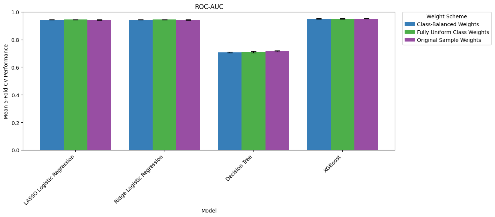

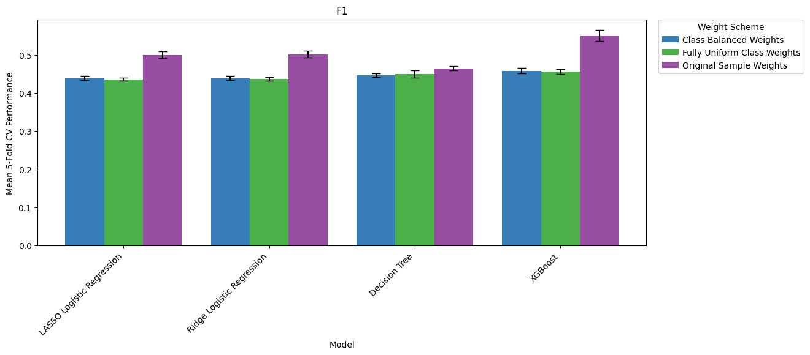

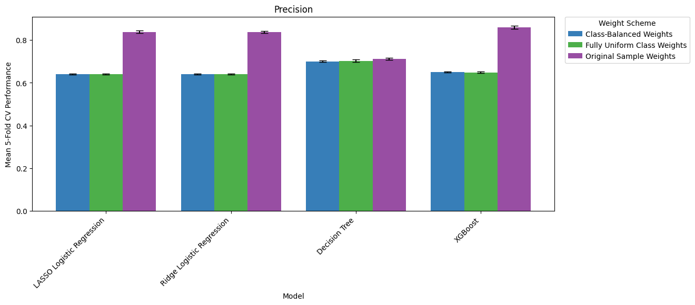

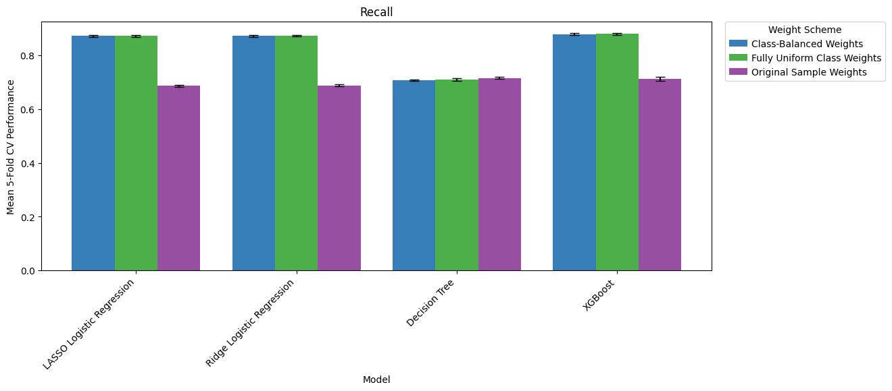

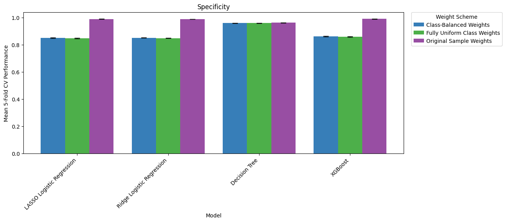

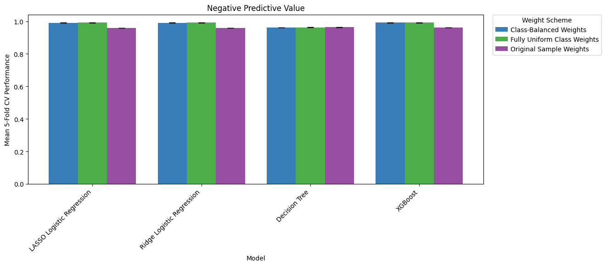

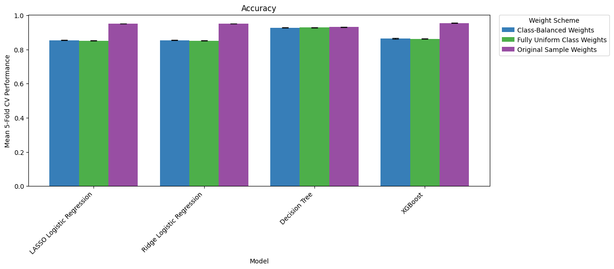

### A.3 Supporting Figures for Segmentation

The following sections present the demographic, economic, and socioeconomic feature distributions used to interpret and assign labels to the clusters identified by HDBSCAN.

#### A.3.1 Demographic Feature Distributions by Cluster

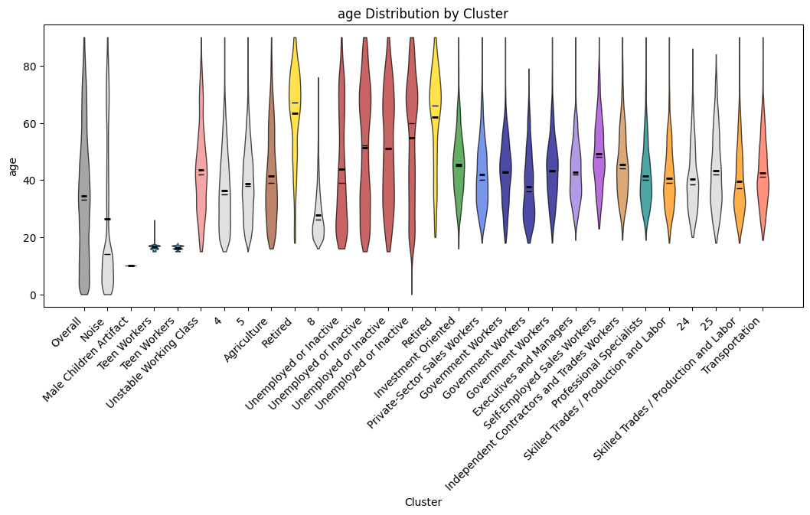

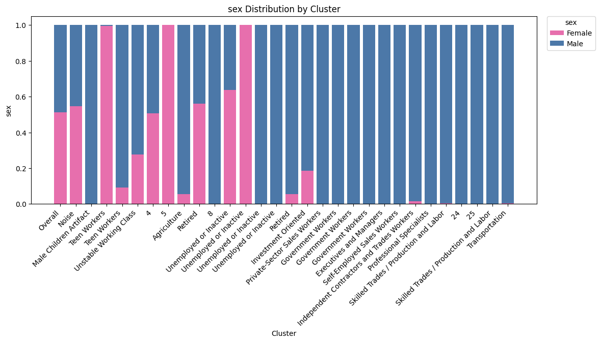

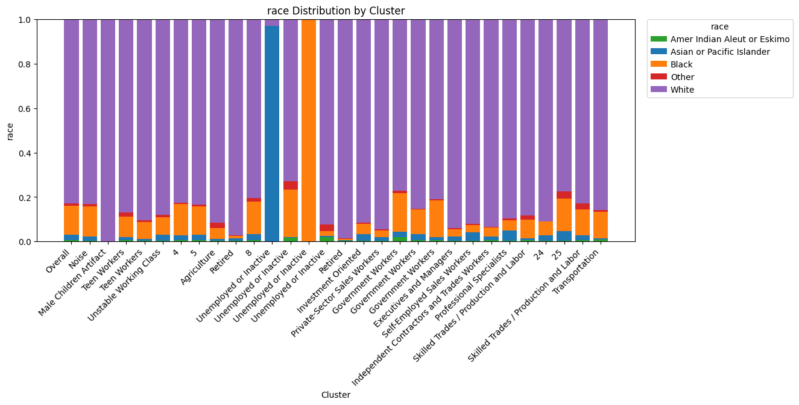

#### A.3.2 Economic Feature Distributions by Cluster

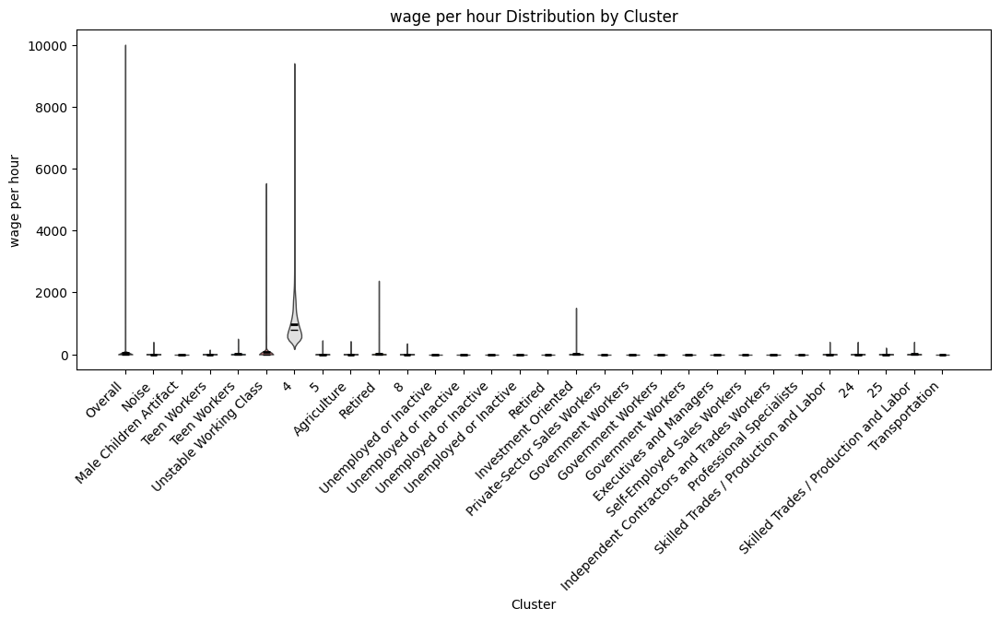

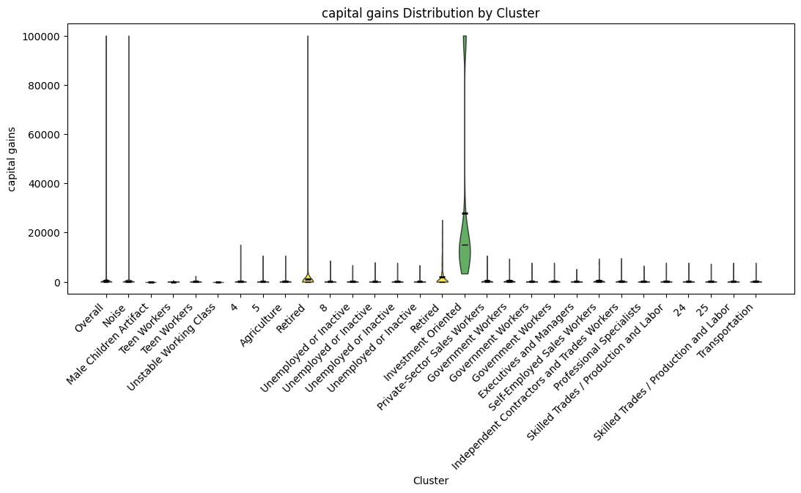

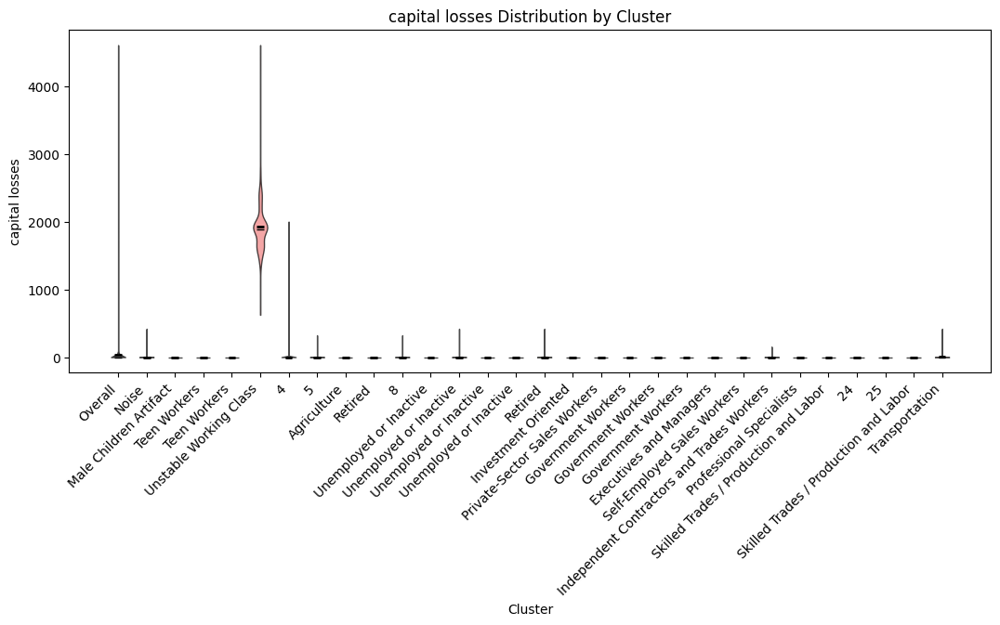

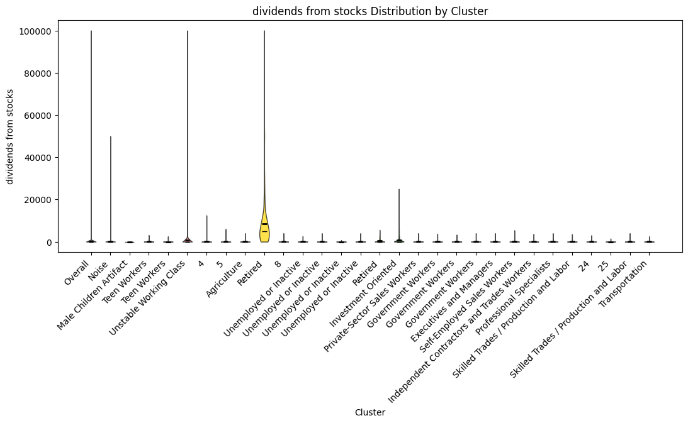

#### A.3.3 Socioeconomic Feature Distributions by Cluster

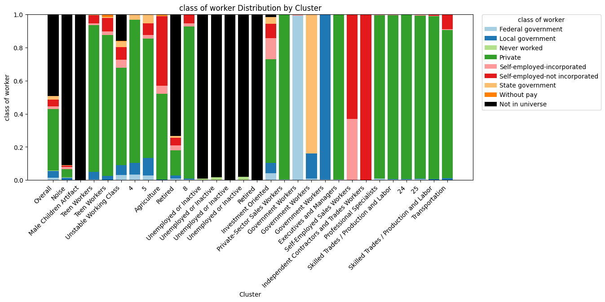

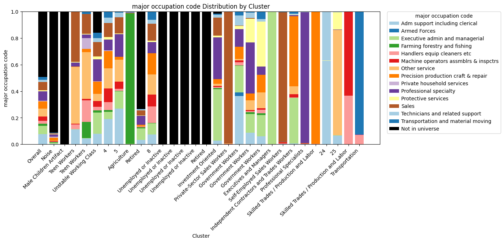

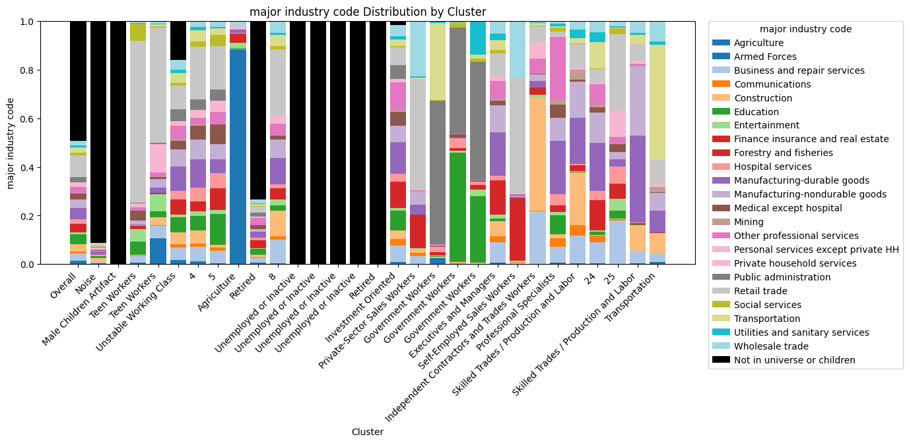
